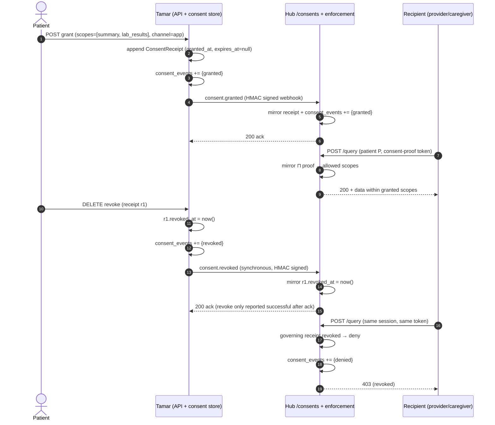

# Consent & Sharing Contract (v1)

**Document ID:** DOC-002 · **Status:** Draft — pending sign-off (backend-agent, tamar-agent) · **Version:** 1.0
**Author:** docs-lead · **Consumers:** MED-002 (hub consent service + enforcement), TAM-001 (Tamar→hub propagation), TAM-002 (family/caregiver care-circle grants)

This is the authoritative wire-level and semantic contract for patient consent and data-sharing grants across the NanoSense platform. Implementations MUST NOT fork this contract; disagreements are raised as open questions (§13) and resolved here.

---

## 1. Purpose & Problem Statement

Today consent lives only in Tamar:

- Immutable consent log: `UserConsent` at `/Users/a1234/workspaces/nanosense-workspace/Tamar-telemedicine/backend/app/models/compliance.py:104` (docstring `:106-121`: *"Immutable consent record. NEVER UPDATE a row — only INSERT new rows."*)
- Revocable scoped sharing grants: `PatientSharingGrant` at `/Users/a1234/workspaces/nanosense-workspace/Tamar-telemedicine/backend/app/models/patient_sharing.py:13`

The med-intelligent hub trusts only the tenant JWT (`/Users/a1234/workspaces/nanosense-workspace/med-intelligent/fastapi_medical_rag_backend.py:1264` `POST /query`; `/Users/a1234/workspaces/nanosense-workspace/med-intelligent/tenant_routes.py:835` `POST /tenants/{tenant_id}/ingest`), so patient grants do not constrain hub RAG queries or ingest (architecture gap review G1, §3.4 — "Patient-Controlled Consent" legend element is ⚠️ partial).

This document defines:

1. The `ConsentReceipt` model (§3)
2. The scope enum and its data-source mapping (§4)
3. Grant/revoke semantics, including revocation latency (§5)
4. The immutable `consent_events` audit schema (§6)
5. The Tamar↔hub propagation contract (§7) — both options defined, one recommended
6. FHIR R4 `Consent` alignment (§8)
7. Enforcement points (§9)
8. A testable sequence (§10) and test scenarios (§11)

## 2. Terminology & Principals

| Term | Definition |
|---|---|
| **Hub** | The med-intelligent Medical RAG API (`med-intelligent`) — central query/ingest service |
| **Tamar** | The Tamar-telemedicine platform — system of record for patients, EHR, and consent |
| **Patient** | The data subject whose records are shared (`User.fhir_patient_id` is the cross-system Patient reference — never the internal user PK) |
| **Recipient (grantee)** | The principal data is shared *to* — a provider, family member, or caregiver (per `granted_to`, §3.2) |
| **Granter** | The principal who performs the grant/revoke action — the patient, or a delegated guardian (§5.1) |
| **Active receipt** | A `ConsentReceipt` with `revoked_at = NULL` and (`expires_at = NULL` or `expires_at > now`), and which is the governing receipt for its (patient, recipient) pair (§5.3) |
| **Patient-scoped data** | Any record indexed by a patient identifier (EHR entries, prescriptions, lab orders, immunizations, allergies, imaging reports, AI insights derived from these) |

---

## 3. ConsentReceipt Model

### 3.1 Fields

The consent-semantics field set is **exactly** the eight fields below (DOC-002 acceptance criterion). Implementations additionally assign an opaque `receipt_id` (UUID) as the storage primary key — an identity handle, not a consent-semantics field — referenced by `consent_events.receipt_id` (§6).

| Field | Type | Required | Description |
|---|---|---|---|
| `patient_id` | UUID (or `fhir_patient_id` string on the wire) | yes | The data subject. Cross-system references MUST use Tamar `User.fhir_patient_id` semantics |
| `purposes[]` | array of purpose codes | yes (min 1) | Why the data is shared. Reuses the Tamar `ConsentPurpose` vocabulary (`compliance.py` enums, `:48-91`); sharing receipts use `healthcare_service_delivery`, optionally `third_party_referral` (see Open Question OQ-6) |
| `scopes[]` | array of scope enum values | yes (min 1) | *What* data is shared — see §4. One of `summary`, `treatment_history`, `lab_results`, `ai_insights`, `imaging`, `research` |
| `granted_to` | principal object (§3.2) | yes | *Who* receives the data. Must accommodate non-provider grantees (TAM-002 family/caregiver) |
| `granted_at` | ISO-8601 UTC timestamp | yes | When the grant was made. Set on append; never changes |
| `expires_at` | ISO-8601 UTC timestamp \| `null` | no | Optional expiry. `null` = no expiry (valid until revoked). At `expires_at` the receipt stops being active (§5.4) |
| `revoked_at` | ISO-8601 UTC timestamp \| `null` | no | Set once by a revoke action on the active receipt. `null` = not revoked |
| `channel` | enum: `app` \| `web` \| `otp` \| `provider_invite` \| `admin` | yes | How the consent was collected. `provider_invite` reserved for TAM-003 external-provider invites; `admin` = administratively recorded (e.g. digitised paper form) |

### 3.2 `granted_to` (recipient principal)

```json
{
  "principal_id": "uuid-of-user",
  "role": "doctor | nurse | specialist | family | caregiver | …",
  "institution": { "tenant_id": "uuid", "org_name": "optional" }
}
```

- `role` MUST allow non-provider values (`family`, `caregiver`) so TAM-002 care-circle members can be grantees without schema change.
- `institution.tenant_id` identifies the grantee's tenant/institution; cross-institution grants are out of scope for v1 (MED-003 / TAM-003, Phase 2).

### 3.3 Immutability rules (normative)

1. **Revisions append.** Any change to `purposes[]`, `scopes[]`, `granted_to`, or `expires_at` is a *revision*: append a **new** receipt. Never UPDATE these fields on an existing row.
2. **Revoke mutates exactly one field.** A revoke action sets `revoked_at` on the active receipt only. No other field is ever updated.
3. **Never delete.** There is no DELETE path for receipts. Rows are retained as legal proof (GDPR Art. 7(1) rationale, mirrored from `UserConsent` docstring `compliance.py:112-113`).
4. **Append-only audit.** Every receipt append/mutation emits a `consent_events` row (§6).
5. **Re-grant after revocation** appends a new receipt (a new `granted_at`, new `receipt_id`) — it never "un-revokes" the old one (§5.3).

This blends the two existing Tamar patterns: `UserConsent`'s append-only proof requirement (`compliance.py:106-121`) and `PatientSharingGrant`'s active-row semantics (`revoked_at IS NULL` partial unique index, `patient_sharing.py:15-23`).

### 3.4 Field → consuming-system mapping (parity table)

Every field maps to at least one consuming system, per DOC-002 testing requirements.

| ConsentReceipt field | Tamar column / code | Hub enforcement point (MED-002) | FHIR R4 (§8) |
|---|---|---|---|
| `patient_id` | `PatientSharingGrant.patient_id` (`patient_sharing.py:26`); `UserConsent.user_id` (`compliance.py:131`) | Patient-partition filter on `/query` + ingest; RLS tenant isolation preserved | `Consent.patient` |
| `purposes[]` | `UserConsent.purpose` (`compliance.py:139-141`, `ConsentPurpose`) | Purpose check in enforcement middleware (`access_basis`) | `Consent.provision.purpose` |
| `scopes[]` | `PatientSharingGrant.scopes` (`patient_sharing.py:29`, JSONB); `Scope` literal (`app/api/patient_sharing.py:22`) | Scope resolution for query retrieval + ingest admission | `Consent.provision.code` |
| `granted_to` | `PatientSharingGrant.provider_id` + `tenant_id` (`patient_sharing.py:27-28`); CareCircle member (TAM-002) | Recipient identity check (caller ↔ recipient match) | `Consent.provision.actor` |
| `granted_at` | `PatientSharingGrant.created_at` (`patient_sharing.py:30`); `UserConsent.granted_at` (`compliance.py:160-162`) | Receipt store; `consent_events.timestamp` baseline | `Consent.dateTime`, `Consent.provision.period.start` |
| `expires_at` | *(new — TAM-002 circle-membership expiry pattern)* | Deny when `now >= expires_at` | `Consent.provision.period.end` |
| `revoked_at` | `PatientSharingGrant.revoked_at` (`patient_sharing.py:33`); analogue `UserConsent.withdrawn_at` (`compliance.py:163-166`) | Deny when not `NULL` (same-session, §5.5) | `Consent.status = inactive` |
| `channel` | `UserConsent.channel` (`compliance.py:142-144`, `ConsentChannel`) | Audit metadata on `/consents` writes | `Consent.policy` / extension (see OQ-5) |

> **Note (channel divergence):** the contract's channel enum (`app | web | otp | provider_invite | admin`) is intentionally smaller than Tamar's `ConsentChannel` (`web_registration_form`, `mobile_app_onboarding`, `patient_portal`, `paper_form_digitised`, `verbal_recorded`, `api` — `compliance.py:75-91`). Migration MUST be a mechanical map (OQ-1).

---

## 4. Scope Enum & Data-Source Mapping

### 4.1 Enum

```
summary | treatment_history | lab_results | ai_insights | imaging | research
```

### 4.2 Data covered per scope

Model classes are in `/Users/a1234/workspaces/nanosense-workspace/Tamar-telemedicine/backend/app/models/health_record.py` unless noted.

| Scope | Data covered | Data sources (model / route) | v1 status |
|---|---|---|---|
| `summary` | Patient overview/demographics, active problem list, allergies, immunizations | `PatientEHRRecord` (`health_record.py:184`), `Allergy` (`:721`), `Immunization` (`:693`) | **Active** |
| `treatment_history` | Provider-entered clinical entries (consultation/follow-up notes), prescriptions, care episodes | `EHREntry` (`:231`, types via `EHREntryType` `:222`), `Prescription` (`:303`); FHIR-imported rows via `fhir_import_service.py:89-90` (creates `EHREntry`, `Prescription`, `LabOrder`) | **Active** |
| `lab_results` | Lab orders and their results | `LabOrder` (`:385`); endpoint family in `app/api/labs.py`; analytics fan-in at `app/api/health_analytics.py:150-151` | **Active** |
| `ai_insights` | AI/RAG-derived outputs: analytics summaries, insights generated from the patient's records | Hub RAG query outputs (`/query`); Tamar AI services (`app/services/ai/`); ingest bookkeeping `rag_ingest_log` | **Active** |
| `imaging` | Imaging orders and radiology/imaging reports | `ImagingOrder` (`:486`, `ImagingModality` `:467`), `EHRDocument` imaging documents (`:626`); hub `POST /imaging/ingest` (`fastapi_medical_rag_backend.py:2301`) | **Reserved** (future) |
| `research` | Pseudonymised/secondary-use data for research | Derived from the above under research governance; aligns with `ConsentPurpose.AI_MODEL_TRAINING` / `ANONYMOUS_ANALYTICS` (`compliance.py:48-71`) | **Reserved** (future) |

**Scope-to-record shorthand for enforcement filters:** `summary` → {PatientEHRRecord, Allergy, Immunization}; `treatment_history` → {EHREntry, Prescription}; `lab_results` → {LabOrder}; `ai_insights` → {AI insights}; `imaging` → {ImagingOrder, imaging EHRDocuments} (reserved); `research` → derived/pseudonymised views (reserved).

### 4.3 Parity with current Tamar `PatientSharingGrant` scopes

Grep-verified parity (DOC-002 testing requirement). The current Tamar scope literal is `Scope = Literal["summary", "treatment_history", "lab_results", "ai_insights"]` (`/Users/a1234/workspaces/nanosense-workspace/Tamar-telemedicine/backend/app/api/patient_sharing.py:22`; frontend mirror `PatientShareScope`, `frontend/src/pages/PatientDashboardPage.tsx:66`).

| Existing Tamar grant scope | Contract enum value | Mapping |
|---|---|---|
| `summary` | `summary` | 1:1 |
| `treatment_history` | `treatment_history` | 1:1 |
| `lab_results` | `lab_results` | 1:1 |
| `ai_insights` | `ai_insights` | 1:1 |
| — | `imaging` | Reserved (future) |
| — | `research` | Reserved (future) |

**Every existing grant scope maps to an enum value — no existing scope is dropped or renamed.** The current Tamar scopes are therefore a strict **subset** of the contract enum. Migration of existing `PatientSharingGrant.scopes` rows to receipt scopes is mechanical (handoff constraint for TAM-001).

### 4.4 Reserved-scope enforcement

Receipts MAY legally carry `imaging` or `research` (the enum is stable), but until the corresponding data classes are onboarded, enforcement MUST treat them as **deny-by-default**: they grant no retrievable data. Hubs and Tamar MUST NOT error on receipt storage, only on data release.

---

## 5. Grant / Revoke Semantics

### 5.1 Who can grant

- **The patient themself** (self-grant; `channel` records how it was captured).
- **A delegated guardian** acting for the patient (minor, incapacitated patient, or formally delegated caregiver). Guardian authority MUST itself be recorded (a delegation/relationship record) and the `consent_events.actor` (§6) MUST identify the guardian plus the on-behalf-of patient. The receipt's `patient_id` is always the data subject.
- Grantees (`granted_to`) may be **any principal role** — provider roles today (`doctor`, `nurse`, …, per Tamar `UserRole`), `family`/`caregiver` under TAM-002. Providers cannot grant on the patient's behalf; `channel = admin` grants require an audited admin action (actor role `admin`).

### 5.2 Granularity

- **Per-recipient, per-scope.** One receipt = one recipient (`granted_to`) × a set of scopes × purposes. A patient may hold many receipts (one per recipient).
- Scopes within a receipt are additive but independently revocable only by replacing the receipt (revision appends a new receipt with the reduced scope set — §5.3) or by revoking the whole receipt.
- A recipient's **effective allowed scopes** = `scopes[]` of their governing active receipt (§5.3). Nothing outside that set is accessible.

### 5.3 Idempotent grant, revision, and precedence

1. **Idempotent grant.** Repeating an identical grant (same `patient_id`, `granted_to`, `scopes[]`, `purposes[]`, `expires_at`) while an identical active receipt exists is a no-op: return the existing active receipt (same `receipt_id`); no new receipt, no new `granted` event.
2. **Revision.** Any non-identical grant for the same (patient, recipient) **appends a new receipt** and the new receipt becomes governing. The superseded receipt is permanently non-governing (it keeps `revoked_at = NULL`, its history is preserved per §3.3, but it never grants access again).
3. **Governing receipt (precedence).** At most one receipt governs per (patient, recipient) — mirrors Tamar's partial unique index on `(patient_id, provider_id) WHERE revoked_at IS NULL` (`patient_sharing.py:15-23`). Precedence: the receipt with the newest `granted_at` for the pair governs; older receipts are superseded (§5.3.2). **Revocation precedence:** a revoked receipt is dead forever and no superseded receipt is ever resurrected — if the governing receipt is revoked or expired and no newer receipt exists, the recipient has **no** access. Only a fresh grant (new receipt) restores access.
4. **Re-grant after revocation** = a new receipt with a new `granted_at`, optionally narrower scopes. This is how "undo" works; there is no un-revoke.

### 5.4 Expiry

- `expires_at = null` → no expiry.
- When `now >= expires_at`, the receipt is expired: access MUST be denied, and an `expired` consent event MUST be recorded (§6). Expiry is evaluated at access time (and/or by a scheduled sweep) — it is not a mutation of the receipt (the receipt keeps its original `expires_at`).
- An expired receipt can be superseded only by a new grant.

### 5.5 Revocation semantics & latency (normative)

- **Who can revoke:** the patient, the delegated guardian who granted, or an admin (audited). Recipients cannot revoke.
- **What revoke does:** sets `revoked_at = now()` on the governing active receipt (the single allowed mutation, §3.3.2) and emits a `revoked` consent event. Never deletes.
- **Revocation latency requirement:** once revocation is committed in Tamar, the hub MUST deny the recipient's next access to that patient's data **within the same session** — no cached grant may be reused after revoke. Concretely:
  - Tamar→hub propagation of `consent.revoked` MUST complete (or be bypassed by an on-access check) before the hub serves the next request in that session (§7; recommended mechanism guarantees this synchronously).
  - Hub and Tamar caches of consent state, if any, MUST be invalidated on revoke or have TTL ≪ session length and MUST be checked against the authoritative state at request time.
  - **Testable scenario (DOC-002):** session starts with valid grant → recipient queries successfully → patient revokes mid-session → recipient's next `/query` (same session, same token) returns **403** and a `denied` consent event is logged. See §11.

---

## 6. Immutable Consent-Event Audit Schema

Append-only table `consent_events`. **No UPDATE and no DELETE path exists** (enforced at the storage layer: e.g. Postgres `REVOKE UPDATE, DELETE` on the table or a trigger that raises on non-INSERT operations). This extends the `UserConsent` append-only principle (`compliance.py:106-121`) into an event log.

| Column | Type | Description |
|---|---|---|
| `event_id` | UUID (PK) | Unique event identifier |
| `receipt_id` | UUID (FK → receipts, ON DELETE RESTRICT) | The `ConsentReceipt` this event concerns; RESTRICT prevents erasure from destroying audit history |
| `event_type` | enum: `granted` \| `revoked` \| `expired` \| `denied` | `granted` — receipt appended (and each revision); `revoked` — `revoked_at` set; `expired` — expiry observed at access/sweep; `denied` — an access attempt was refused (no valid grant, revoked, expired, or scope mismatch) |
| `actor` | principal object | Who caused the event: `{user_id, role, on_behalf_of?}` — for grants/revoke the granter (patient or guardian with `on_behalf_of` = patient); for `denied` the accessor whose request was refused |
| `timestamp` | ISO-8601 UTC | Event time |
| `ip` | inet (nullable) | Client IP of the actor at event time (mirrors `UserConsent.ip_address`, `compliance.py:152-153`) |
| `metadata` | JSONB | Free-form detail: `channel`, `scopes[]`, `purposes[]`, request path, hub event id (`jti`), reason for denial, propagation delivery info |

Rules:

- Events are emitted for **every** receipt lifecycle transition and every denial — the log is the authoritative audit trail (HIPAA 45 CFR 164.312(b) audit controls; supports GDPR Art. 7(1) demonstrability).
- `denied` events do **not** create or modify receipts; they are pure audit observations.
- Event rows are insert-only from a single write API (`record_consent_event`); readers have SELECT only.

---

## 7. Tamar ↔ Hub Propagation Contract

Both mechanisms are specified; §7.3 selects one as normative for Phase 1. TAM-001 implements **whichever this section marks recommended** — implementations MUST NOT fork the contract.

Shared envelope (both options): `ConsentReceipt` content (§3) travels with a `receipt_id` and the consent-event type; patient identity on the wire is `fhir_patient_id`-compatible per the Tamar AGENTS.md cross-system rule.

### 7.1 Option A — Webhook events (push)

Tamar posts consent lifecycle events to hub `POST /consents` (endpoint owned by MED-002):

- **Event types:** `consent.granted`, `consent.revoked` (plus `consent.expired`, `consent.updated` as revision-grant). Envelope mirrors the existing telemedicine webhook shape (`WebhookEnvelope {id, type, data, partner_id}` — `/Users/a1234/workspaces/nanosense-workspace/med-intelligent/telemedicine_webhook.py:61-66`) with `id` used as the idempotency key (duplicate events rejected, matching existing subscriber-event behavior).
- **Authentication:** HMAC partner signatures exactly like `telemedicine_webhook.py:8-15` — `X-Partner-Signature: t=<unix-timestamp>,v1=<hmac-sha256-hex>` computed over `<timestamp>.<raw-body>`; ±300 s timestamp tolerance (`telemedicine_webhook.py:96`); per-partner secrets `PARTNER_WEBHOOK_SECRETS` with `TELEMEDICINE_WEBHOOK_SECRET` fallback; `*_ALLOW_UNSIGNED` only for local dev.
- **Semantics:** hub upserts a local mirror of the receipt. `consent.revoked` sets `revoked_at` on the mirrored active receipt and is **terminal** (no subsequent `granted` event may resurrect it — re-grant arrives as a new receipt id).
- **Delivery failure / retry:** at-least-once delivery; sender retries with exponential backoff (Tamar `WebhookDispatcher` pattern: 3 retries, exponential back-off — `/Users/a1234/workspaces/nanosense-workspace/Tamar-telemedicine/backend/app/models/webhook_subscription.py:9-12`), then dead-letters to a reconciliation queue. **Reconciliation:** Tamar MUST periodically re-send the active-receipt set (or diff) so lost events self-heal. Revocation events MUST be prioritized over grants in the retry queue.
- **Revocation latency:** satisfied strictly only if the webhook lands before the next request in the session. A push-only design has a delivery window in which a revoked grant is still honored at the hub — §7.3 closes this window (synchronous ack on revoke).

### 7.2 Option B — On-access delegation (pull at query time)

Every patient-scoped hub query, ingest, FHIR Bundle ingest, and re-index request carries a **Tamar-issued signed authorization proof**. The hub verifies it against the current consent mirror. The implemented v1 claim schema, receipt fingerprint, tenant bindings, and denial rules are normative in [Tamar–NanoSense patient authorization v1](patient-rag-authorization-v1.md).

**Historical five-claim sketch (superseded by the v1 contract linked above):**

```json
{
  "patient_id": "uuid or fhir_patient_id",
  "recipient_id": "uuid of the grantee principal",
  "scopes": ["summary", "lab_results"],
  "exp": 1780000000,
  "jti": "unique-token-id"
}
```

- `exp` — expiry; MUST be short (recommendation: ≤ 300 s, matching the webhook timestamp tolerance).
- `jti` — unique token id; hub MUST NOT accept a `jti` after the corresponding grant is revoked (deny-list or receipt-mirror check).
- Signature: HMAC-SHA256 or asymmetric (Ed25519) over the serialized payload, carried like the webhook signature scheme (§7.1).

**Properties:** revocation is immediate *for newly issued tokens* (Tamar stops issuing, or hub `jti` check fails), and no consent mirror can drift. Costs: to invalidate **already-issued unexpired tokens** the hub needs a revocation list or a callback — otherwise exposure lasts up to `exp` (violates §5.5); per-request signing cost; hub depends on proof verification keys and on Tamar availability for token issuance.

### 7.3 Recommendation (normative for Phase 1)

**Recommended: Option A (webhook events) as the primary propagation mechanism, with the Option B consent-proof token as a secondary check on `/query` requests.**

Rationale:

1. MED-002's deliverable is hub-side `/consents` CRUD + enforcement middleware — a stateful mirror (Option A) matches that architecture and keeps hub enforcement local (no per-request callback to Tamar).
2. The same-session revocation requirement (§5.5) is met strictly when `consent.revoked` is processed **synchronously before the revoke call returns** (Tamar awaits hub ack on revoke, bounded retry; reconciliation queue only as fallback). Revokes are low-volume, so this is affordable.
3. Option B alone leaves already-issued tokens valid until `exp` — exactly the "same-session after revocation" failure DOC-002 forbids — unless a `jti` deny-list is added, which reintroduces shared state (Option A's mirror) anyway.
4. The signed consent-proof token remains valuable as defense in depth: attached to `/query` requests, its `scopes`/`recipient_id`/`jti` let the hub cross-check the mirror and log `access_basis` (TAM-001 requires `rag_client.py` to attach a consent proof to every query).

**Normative Phase-1 flow:** grant/revoke in Tamar → synchronous signed webhook to hub `/consents` (HMAC per §7.1) → hub mirrors receipt + appends `consent_events` → hub queries carry the consent-proof token (§7.2 payload) → hub enforces **mirror ⊓ proof** (intersection of scopes; either side missing ⇒ 403).

**Revocation latency guarantee:** revoke commits in Tamar and the hub mirror is updated within the revoke request (synchronous ack); the next hub request in the same session is denied because enforcement reads the mirror per-request (§9). If the synchronous post fails, Tamar MUST fail closed — surface an error to the patient UI and retry in background. A revocation that is not propagated MUST NOT be reported as successful.

---

## 8. FHIR R4 Alignment

`ConsentReceipt` maps to the FHIR R4 **`Consent`** resource so med-intelligent's `fhir_adapter/` can emit conforming resources (and MED-003 emits `Consent` + `Provenance` on external shares).

| ConsentReceipt / event | FHIR R4 `Consent` element | Notes |
|---|---|---|
| receipt (state) | `Consent.status` | `active` when governing and unrevoked/unexpired; `inactive`/`rejected` on revoke (OQ-4) |
| `scopes[]` | `Consent.scope` (required) + `Consent.provision.code` / `provision.data` | `Consent.scope` uses FHIR consent scope codes (`patient-privacy` for clinical scopes; `research` for the `research` scope); per-scope detail carried in `provision.code` (local scope enum codes) or `provision.data` |
| `purposes[]` | `Consent.provision.purpose` | Maps from the Tamar `ConsentPurpose` vocabulary to FHIR purpose-of-use codes |
| `patient_id` | `Consent.patient` | Reference(Patient) — `fhir_patient_id`, never internal PK |
| `granted_to` | `Consent.provision.actor` | `actor.reference` = recipient (Practitioner/RelatedPerson/Person), `actor.role` = grantee role incl. `family`/`caregiver` |
| `granted_at` | `Consent.dateTime` + `provision.period.start` | |
| `expires_at` | `Consent.provision.period.end` | Omit when null |
| revoke action | `Consent.provision.type` = `deny` (or a deny provision appended) + status change | `provision.type` is `permit` for granted provisions, `deny` for revoked/never-granted; the revoked receipt is retained (never deleted) and reflected as `inactive` + deny provision |
| `channel` | `Consent.policy` / `Consent.category` or extension | See OQ-5 |

**Provenance:** every actual data share (a successful scope-releasing query or record export) SHOULD emit a FHIR **`Provenance`** resource — `target` = shared resources, `agent` = patient (author/owner) and recipient (assembler/performer), `recorded` = share time — so downstream consumers see who shared what with whom and when. MED-003 emits `Provenance` on external shares; MED-002 SHOULD do the same for hub-side releases.

---

## 9. Enforcement Points

Consent is enforced at **three** layers. Each denies with `403` (never a silent empty result for patient-scoped data) and appends a `denied` consent event (§6) with `access_basis` recorded on PHI access.

### 9.1 Hub `/query` + ingest (MED-002)

- `POST /query` (`/Users/a1234/workspaces/nanosense-workspace/med-intelligent/fastapi_medical_rag_backend.py:1264`) and ingest paths (`POST /tenants/{tenant_id}/ingest` — `tenant_routes.py:835`; `POST /imaging/ingest` — `fastapi_medical_rag_backend.py:2301`; `/ingest/csv` — `ingest_routes.py:43`).
- Enforcement middleware derives per-patient allowed scopes from the caller identity + the consent mirror ⊓ consent-proof token (§7.3). **No valid grant for a requested patient scope ⇒ `403`.**
- Applies to retrieval *and* ingest (ingesting into a patient's index without a grant is equally a consent violation).
- Per-tenant isolation (RLS) is preserved on top of — not instead of — grant checks (MED-002 acceptance criteria). Every PHI access logs `access_basis`.

### 9.2 Tamar scope resolution — `app/core/authz/patient.py`

- `authorize_patient_access` (`/Users/a1234/workspaces/nanosense-workspace/Tamar-telemedicine/backend/app/core/authz/patient.py:22-88`) resolves granted scopes from `PatientSharingGrant` (`:58-75`) and enforces subset/intersection semantics (`require_all_scopes`, `:80-82`).
- Under this contract, the source of truth becomes the consent receipt store (or the same mirror hub-side), so Tamar and hub answers agree (TAM-001: "`check_patient_consent_for_purpose` returns the same result for the same grant state in both Tamar and the hub").
- Purpose checks remain via `check_patient_consent_for_purpose` (`app/services/consent.py`); PHI audit via `record_phi_access` (`app/services/audit/phi_access.py`).

### 9.3 Provider EHR record scope checks — `app/api/provider_ehr.py`

- `_require_record_scope` (`/Users/a1234/workspaces/nanosense-workspace/Tamar-telemedicine/backend/app/api/provider_ehr.py:172`) gates every record read; it currently enforces the consulted-patient relationship (`_require_consulted_patient`, `:168`) and MUST additionally check the recipient's grant scopes for the record's class (e.g. a `LabOrder` read requires `lab_results`).
- Reads are audited with `access_basis` (e.g. `provider_treating` — `_audit_provider_read`, `:187-196`).

---

## 10. Sequence Diagram — Grant → Query → Revoke → Denied



ASCII fallback:

```
Patient        Tamar                 Hub
  |--grant----->|                      (append receipt, event=granted)
  |             |--consent.granted--->| (mirror receipt, event=granted)
  |             |<-----200 ack--------|
  |             |                      |<--query(+proof)-- Recipient
  |             |                      |---200 data-------> Recipient
  |--revoke---->|                      (revoked_at=now, event=revoked)
  |             |--consent.revoked--->| (mirror revoked_at, ack)
  |             |<-----200 ack--------|
  |             |                      |<--query(same session)-- Recipient
  |             |                      |  (denied: event=denied)
  |             |                      |---403-----------> Recipient
```

---

## 11. Test Scenarios (normative acceptance)

1. **Scope-enum parity:** every scope present in Tamar `PatientSharingGrant` payloads (`summary`, `treatment_history`, `lab_results`, `ai_insights` — `app/api/patient_sharing.py:22`) maps 1:1 to a contract enum value (§4.3). Grep-verified against `patient_sharing.py`.
2. **Revocation latency (same session):** session begins with a valid active grant → recipient's `/query` succeeds → patient revokes mid-session → the recipient's **next** `/query` in the same session (same auth token) returns `403` and a `denied` event is logged. No cached grant may be reused (§5.5).
3. **Idempotent grant:** repeating an identical grant returns the same `receipt_id` and does not append a second `granted` event (§5.3.1).
4. **Revision immutability:** changing scopes appends a new receipt; the superseded receipt's fields are byte-identical to before (§3.3).
5. **Expiry:** a receipt with `expires_at` in the past denies access and logs `expired`/`denied` (§5.4).
6. **Re-grant after revoke:** new receipt required; old `revoked_at` stays set (§5.3.4).
7. **Field parity:** every `ConsentReceipt` field appears in the consuming-system mapping table (§3.4).

---

## 12. Implementation Checklist (by ticket)

| Ticket | Implements | Must conform to |
|---|---|---|
| **MED-002** | Hub `/consents` CRUD; `consent_events` table; enforcement middleware on `/query` + ingest | §3, §6, §7.1 envelope + HMAC, §9.1 |
| **TAM-001** | Tamar→hub propagation (`consent.granted` / `consent.revoked` webhooks per §7.3; `rag_client.py` consent-proof attachment); `check_patient_consent_for_purpose` parity | §5.5, §7 (Option A primary + proof token), §9.2 |
| **TAM-002** | Care-circle `family`/`caregiver` grants | §3.2 (`granted_to.role`), §5.1 (guardian delegation), §5.2 |
| **MED-003 / TAM-003** (Phase 2, out of scope here) | Cross-institution grants; FHIR `Consent`/`Provenance` emission on external shares | §4.4 (`imaging`/`research` reserved), §8 |

---

## 13. Open Questions

Marked explicitly; resolve before the v1 sign-off or defer with an owner.

- **OQ-1 (channel mapping):** mechanical map from Tamar `ConsentChannel` (6 values) to the contract `channel` enum (5 values) needs ratification — e.g. `web_registration_form`/`patient_portal` → `web`, `mobile_app_onboarding` → `app`, `verbal_recorded`/`paper_form_digitised` → `otp`/`admin`. Owner: tamar-agent.
- **OQ-2 (propagation transport):** if Tamar↔hub traffic already flows through Tamar's `WebhookDispatcher` (`app/services/webhook_dispatcher.py`), should `consent.*` events ride that dispatcher (reusing its 3-retry backoff) or a dedicated synchronous client for the revoke ack (§7.3)? Recommendation: dispatcher for grants, synchronous call + dispatcher fallback for revokes. Owner: backend-agent + tamar-agent.
- **OQ-3 (consent-proof signing key):** HMAC shared secret (consistent with §7.1) vs Ed25519 keypair for the §7.2 token. Recommendation: HMAC in Phase 1 (uniform secret management), revisit for MED-003 external partners. Owner: backend-agent.
- **OQ-4 (FHIR revoke representation):** `Consent.status = inactive` vs `rejected` on revoke (§8). Owner: backend-agent (`fhir_adapter/`).
- **OQ-5 (channel in FHIR):** `Consent.policy` URI vs `Consent.category` vs a standard extension for `channel` (§8). Owner: backend-agent.
- **OQ-6 (purposes vocabulary for sharing receipts):** restrict to `healthcare_service_delivery` + `third_party_referral`, or allow the full `ConsentPurpose` list in `purposes[]`? Affects purpose checks in `check_patient_consent_for_purpose`. Owner: tamar-agent.
- **OQ-7 (guardian delegation storage):** where the guardian's delegated authority is recorded (a `delegations` table? `CareCircle` membership? `UserConsent` purpose?) — required by §5.1 before TAM-002 lands. Owner: tamar-agent.
- **OQ-8 (same-session definition):** "same session" = same auth token lifetime vs same user login; MED-002 tests should pin this down. Suggested: any requests sharing a valid recipient auth token within one token TTL. Owner: backend-agent.

---

## Sign-off

| Reviewer | Role | Status |
|---|---|---|
| backend-agent | MED-002 implementer | ☐ pending |
| tamar-agent | TAM-001 / TAM-002 implementer | ☐ pending |
| docs-lead | Author | ☑ drafted |

*Ticket: DOC-002-consent-contract-spec — tracked internally in ai-nanosense/med-intelligent `docs/tickets/`*
